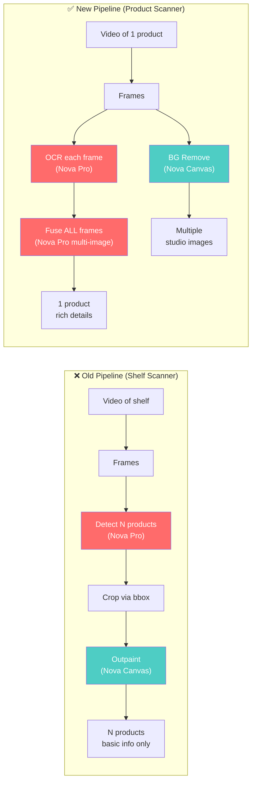
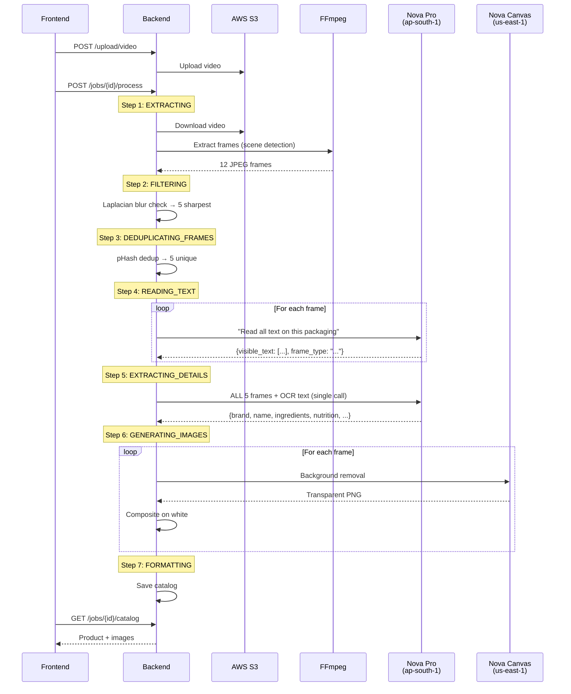

# KiranaStudio — Implementation Summary

## What Was Built

A **single-product video analysis pipeline** that takes a video of one product (shot from multiple angles), extracts comprehensive product details, and generates clean studio-quality images with backgrounds removed.

> [!IMPORTANT]
> This replaces the previous multi-product shelf-scanning pipeline. The entire backend pipeline was rewritten, and the frontend catalog page was redesigned for single-product display.

---

## Architecture: Before vs After



| Aspect | Old Pipeline | New Pipeline |
|--------|-------------|-------------|
| **Input** | Video of store shelf | Video of one product |
| **Detection** | Find multiple products with bboxes | OCR text from each frame angle |
| **AI Fusion** | None (independent per-frame) | Multi-frame fusion (all frames → 1 call) |
| **Image Gen** | Outpainting (crop→canvas→mask→generate) | Background removal (simpler, better) |
| **Output** | N products with basic info | 1 product with rich details + multiple images |
| **Cost** | ~$0.40/video | ~$0.21/video (48% cheaper) |
| **Time** | ~2 min (9 outpaint calls × 14s each) | ~1 min (5 BG removal calls × 5s each) |

---

## Pipeline Stages (7 Steps)



---

## Files Created

### New Pipeline Modules

| File | Purpose | Lines |
|------|---------|-------|
| [text_extractor.py](file:///c:/Users/admin/Desktop/AI4Bharat/backend/app/pipeline/text_extractor.py) | **Pass 1:** Per-frame OCR using Nova Pro. Extracts visible text and classifies frame type (front/back/side) | ~140 |
| [detail_fuser.py](file:///c:/Users/admin/Desktop/AI4Bharat/backend/app/pipeline/detail_fuser.py) | **Pass 2:** Multi-frame fusion. Sends ALL frames + OCR to Nova Pro in a single call for comprehensive product details | ~180 |
| [background_remover.py](file:///c:/Users/admin/Desktop/AI4Bharat/backend/app/pipeline/background_remover.py) | Background removal using Nova Canvas. Composites result onto white background | ~130 |

### Files Modified

| File | Changes |
|------|---------|
| [orchestrator.py](file:///c:/Users/admin/Desktop/AI4Bharat/backend/app/pipeline/orchestrator.py) | **Completely rewritten.** New 7-step pipeline: extract → filter → dedup → OCR → fuse → BG remove → catalog |
| [schemas.py](file:///c:/Users/admin/Desktop/AI4Bharat/backend/app/models/schemas.py) | Added [NutritionFacts](file:///c:/Users/admin/Desktop/AI4Bharat/backend/app/models/schemas.py#43-50), [ProductImage](file:///c:/Users/admin/Desktop/AI4Bharat/backend/app/models/schemas.py#52-57) models. Extended [CatalogProduct](file:///c:/Users/admin/Desktop/AI4Bharat/frontend/src/types/index.ts#38-61) with ingredients, nutrition, barcode, manufacturer, etc. |
| [main.py](file:///c:/Users/admin/Desktop/AI4Bharat/backend/app/main.py) | Added `StaticFiles` mount at `/static/images` so frontend can access generated images via HTTP |
| [bedrock_service.py](file:///c:/Users/admin/Desktop/AI4Bharat/backend/app/services/bedrock_service.py) | Added request/response logging to Nova Pro detection and Nova Canvas calls |
| [product_detector.py](file:///c:/Users/admin/Desktop/AI4Bharat/backend/app/pipeline/product_detector.py) | Added comprehensive logging (still exists but no longer called by orchestrator) |
| [index.ts](file:///c:/Users/admin/Desktop/AI4Bharat/frontend/src/types/index.ts) | Updated types: [NutritionFacts](file:///c:/Users/admin/Desktop/AI4Bharat/backend/app/models/schemas.py#43-50), [ProductImage](file:///c:/Users/admin/Desktop/AI4Bharat/backend/app/models/schemas.py#52-57), enriched [CatalogProduct](file:///c:/Users/admin/Desktop/AI4Bharat/frontend/src/types/index.ts#38-61), new pipeline step names |
| [catalog page.tsx](file:///c:/Users/admin/Desktop/AI4Bharat/frontend/src/app/catalog/%5BvideoId%5D/page.tsx) | **Completely redesigned.** Single-product view with image gallery, detail cards, nutrition grid, tags |
| [processing page.tsx](file:///c:/Users/admin/Desktop/AI4Bharat/frontend/src/app/processing/%5BvideoId%5D/page.tsx) | Updated status text for single-product flow |
| [product_normalizer.py](file:///c:/Users/admin/Desktop/AI4Bharat/backend/app/pipeline/product_normalizer.py) | Fixed [net_weight](file:///c:/Users/admin/Desktop/AI4Bharat/backend/app/pipeline/deduplicator.py#1-9) dict leak (earlier bugfix) |

---

## AI Model Usage

### Nova Pro — Text & Detail Extraction

| Call | Model | Region | Purpose | Tokens |
|------|-------|--------|---------|--------|
| **Pass 1** (×5 frames) | `apac.amazon.nova-pro-v1:0` | `ap-south-1` | Per-frame OCR | 2000 max |
| **Pass 2** (1 call, 5 images) | `apac.amazon.nova-pro-v1:0` | `ap-south-1` | Multi-frame fusion | 4000 max |

### Nova Canvas — Background Removal

| Call | Model | Region | Purpose |
|------|-------|--------|---------|
| **BG Removal** (×5 frames) | `amazon.nova-canvas-v1:0` | `us-east-1` | Remove background → transparent PNG |

> [!NOTE]
> Nova Canvas is only available in `us-east-1`, `eu-west-1`, and `ap-northeast-1`. A separate Bedrock client (`canvas_client`) targets `us-east-1` while the main client stays in `ap-south-1`.

---

## Product Schema (Output)

The pipeline produces a single product with these fields:

```json
{
  "product_id": "878d2ae9-...",
  "brand": "Doritos",
  "product_name": "Doritos Sweet Chili Flavour",
  "variant": "Sweet Chili Flavour",
  "category": "Snacks",
  "net_weight": "113g",
  "price": null,
  "description": "Doritos Sweet Chili Flavour is a popular snack...",
  "tags": ["Doritos", "Sweet Chili", "Snacks", "Chips"],
  "ingredients": "Corn (65%), Vegetable Oil...",
  "nutrition_facts": {"energy": "489kcal", "protein": "6.2g", ...},
  "barcode": "8901491101547",
  "fssai_license": "10012011000125",
  "manufacturer": "PepsiCo India Holdings Pvt. Ltd.",
  "shelf_life": "6 months from packaging",
  "image_url": "http://127.0.0.1:5001/static/images/{video_id}/{id}.png",
  "images": [
    {"image_id": "c713c940-...", "image_url": "http://...", "frame_type": "front"},
    {"image_id": "7d5d9ec5-...", "image_url": "http://...", "frame_type": "back"},
    {"image_id": "fd368b6c-...", "image_url": "http://...", "frame_type": "side"}
  ]
}
```

> [!TIP]
> Fields like `ingredients`, `nutrition_facts`, `barcode` depend on what's visible in the video. If the user doesn't show the back of the product, those fields will be `null`.

---

## Production Run Benchmarks

From the actual test run on `2026-03-08 00:38`:

| Stage | Duration | Details |
|-------|----------|---------|
| **Frame Extraction** | ~1s | FFmpeg produced 12 frames |
| **Filtering** | <1s | 11/12 passed blur check, top 5 selected |
| **Deduplication** | <1s | All 5 unique (removed 0) |
| **OCR (Pass 1)** | ~29s | 5 frames × ~5s each (1 failed JSON parse, gracefully recovered) |
| **Fusion (Pass 2)** | ~4s | Single call with 5 images + OCR |
| **Background Removal** | ~27s | 5 frames × ~5s each |
| **Total** | **~62s** | End-to-end including S3 download |

### Cost for this run:
- OCR: 5 × $0.0008 = $0.004
- Fusion: 1 × $0.004 = $0.004
- BG Removal: 5 × $0.04 = $0.20
- **Total: ~$0.21**

---

## Frontend: Catalog Page

The catalog page was redesigned from a multi-product grid to a single-product detail view:

### Layout
- **Left column:** Image gallery with thumbnail navigation (click to switch between views)
- **Right column:** Product detail cards:
  - Basic Info (brand, name, variant, category, weight, MRP, barcode, shelf life)
  - Tags (pill badges)
  - Manufacturer details (manufacturer name, FSSAI license)
- **Full-width sections:** Ingredients text, Nutrition facts grid

### Processing Page
Updated pipeline steps displayed during processing:
1. Extracting frames from video
2. Filtering blurry frames
3. Removing duplicate frames
4. Reading text from product labels ← **new**
5. Extracting product details ← **new**
6. Generating studio images
7. Formatting catalog

---

## Static Image Serving

Generated images are served via FastAPI `StaticFiles`:

```
Backend: output/generated_images/{video_id}/{image_id}.png
  ↓ mounted at /static/images
URL: http://127.0.0.1:5001/static/images/{video_id}/{image_id}.png
```

This was confirmed working in production:
```
GET /static/images/3d8562bc-.../c713c940-...png HTTP/1.1  200 OK
GET /static/images/3d8562bc-.../7d5d9ec5-...png HTTP/1.1  200 OK
```

---

## Key Design Decisions

1. **Two-pass extraction over single-pass:** Per-frame OCR first ensures we capture text from every angle. The fusion call then combines all OCR + images for a richer result than any single image could provide.

2. **Background removal over outpainting:** Since the video is of a single product (not a shelf), the product fills the frame. Simple background removal produces cleaner results than the old crop→canvas→mask→outpaint chain.

3. **Graceful OCR failure:** If OCR fails for a frame (e.g., JSON parse error), the frame is still included with empty OCR. The fusion step and BG removal still proceed.

4. **Multi-frame Nova Pro call:** All 5 frames + OCR text go into a single API call. Nova Pro supports up to 20 images per request, so this is well within limits.

5. **Static file serving:** Rather than uploading images to S3 for local development, images are served directly from the backend via FastAPI's `StaticFiles` mount.
